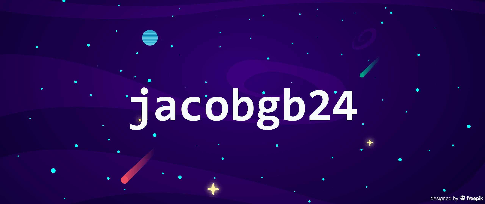

<h1 align="center">👋 Hi, I'm Jacob ‍‍‍‍‍ㅤ</h1>
<h3 align="center">Here's a bit about me</h3>

### 👨‍🎓 Education
* B.S. Computer Science - Brigham Young University 2019
* M.S. Computer Science - Brigham Young University 2021
  * Member of [BYU Internet Measurement and Anti-Abuse Laboratory](imaal.byu.edu)

### 📄 Publications
* [Advertising DNS Protocol Use to Mitigate DDoS Attacks](https://casey.byu.edu/papers/2021_icnp_cookie_advertisement.pdf)
  * Jacob Davis and Casey Deccio
  * ICNP 2021
* [A Peek Into the DNS Cookie Jar: An Analysis of DNS Cookie Use](https://casey.byu.edu/papers/2021_pam_dns_cookies.pdf)
  *  Jacob Davis and Casey Deccio
  *  PAM 2021 
* [DNS Privacy in Practice and Preparation](https://casey.byu.edu/papers/2019_conext_dns_privacy.pdf)
  * Casey Deccio and Jacob Davis
  * CoNEXT 2019 

### ⚡ Interests
* Networks
* Security
* UI/UX
* Android
* Software Engineering Practices
* All things space 🚀🛰️

---

  
  

